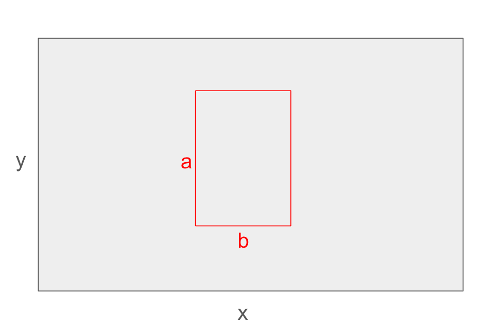
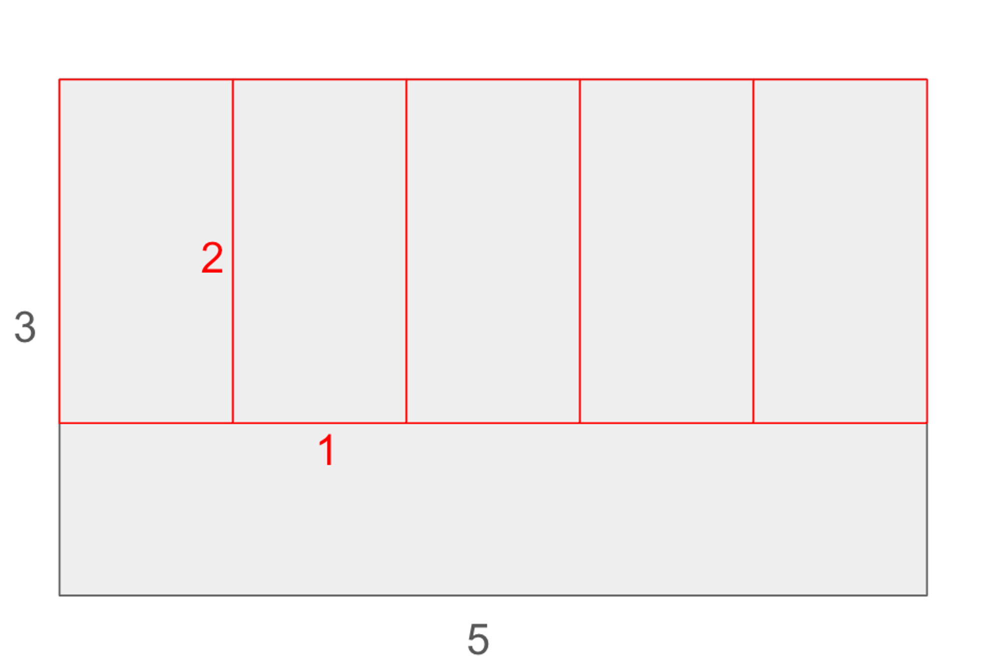

# Ruufsolar Postulacion
Resolver problema para Puesto Dev Junior Fullstack.
## Objetivo

Crear una aplicación front que simule una tarea. Desplegando la información de forma gráfica.

## Problema

Encontrar la máxima cantidad de rectángulos de dimensiones "a" y "b" (paneles solares) que caben dentro de un rectángulo de dimensiones "x" e "y" (techo) y dibujarlos, según se muestra en la siguiente figura:

Por ejemplo, podríamos decir que en el siguiente ejemplo caben 5 rectángulos de dimensiones 1 y 2, en un rectángulo de dimensiones 3 y 5.

