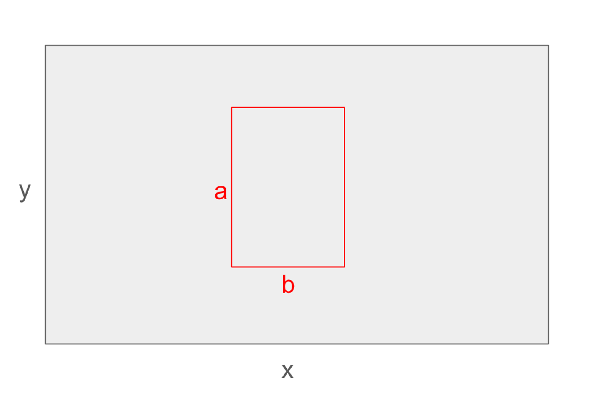
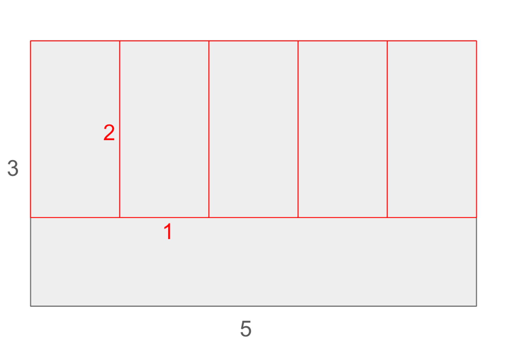
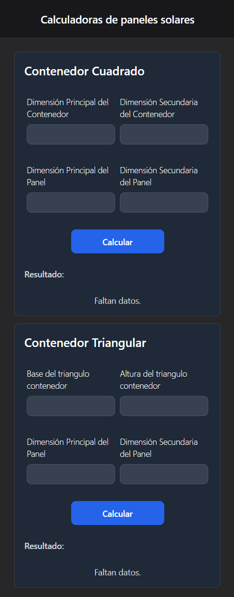
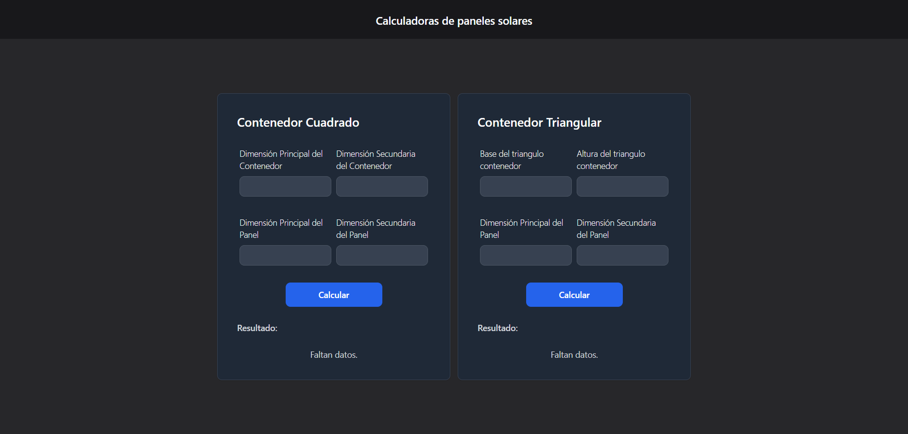
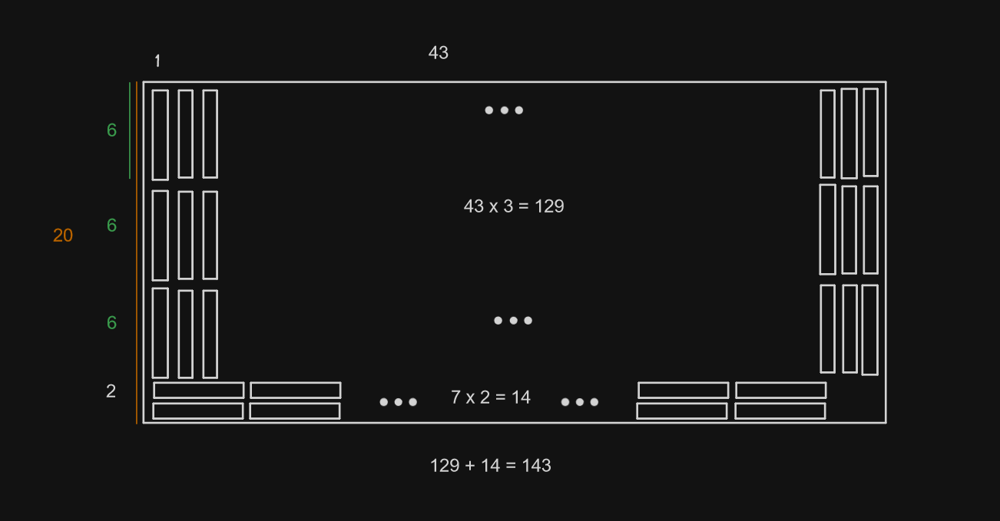
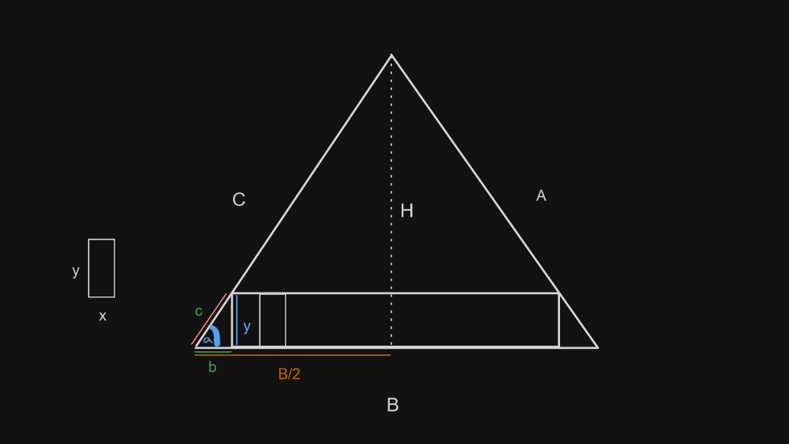

# Ruufsolar Postulacion

Resolver problema para Puesto Dev Junior Fullstack.

## Objetivo

Crear una aplicación front que simule una tarea. Desplegando la información de forma gráfica.

## Problema

Encontrar la máxima cantidad de rectángulos de dimensiones "a" y "b" (paneles solares) que caben dentro de un rectángulo de dimensiones "x" e "y" (techo) y dibujarlos, según se muestra en la siguiente figura:



Por ejemplo, podríamos decir que en el siguiente ejemplo caben 5 rectángulos de dimensiones 1 y 2, en un rectángulo de dimensiones 3 y 5.



## Solución

### Vistas





### Ejecución

Para ejecutar la resolución:

```bash
cd ruufsolar
npm i
npm run build
npm run preview
```

### Explicación

#### Contenedor cuadrado



Supongamos que existe un contenedor rectangular de dimensión 43x20 y los paneles son de dimenión 1x6.
Se definirá la dimensión principal, que en el contenedor es la dimensión 43 y en el panel la de longitud 1, y una dimensión secundaria, que en el contenedor es la dimensión 20 y en el panel la dimensión 6.
Además definiremos que existen dos posibles posiciones para el panel(orientación 1 y 2), una posición donde su dimensión principal queda alineada con su dirección principal y la otra rotada 90 grados, donde su dirección principal queda alineada con su dimensión secundaria. Se puede ver ambas posiciones en el bosquejo.

Comenzaremos el algoritmo como un tetris, tetris invertido para explicar el bosquejo, se comenzará a rellenar el contenedor por filas.
Cuando se acaban las filas, que en este caso sería la tercera fila, se consulta si en el espacio restante que en este caso es de longitud 2 para la dimensión secundaria del contenedor, cabe al menos un panel colocado en otra posición, rotada en 90 grados.

#### Contenedor triangular



Algo similar ocurre en este caso, sólo que no sabemos cuantos paneles caben en una fila o piso de esta piramide, entonces con algo de trigonometría calculamos las dimensiones del triangulo restante en la fila basal.

Se sabe que el angulo basal ($\alpha$) es compartido para todos los triangulos restantes de todas las filas y el triangulo contenedor.

Se sabe que el triangulo restante de la fila basal es de igual dimensión que todos los triangulos restantes de todas las filas.

Dado lo anterior, obtenemos las dimensiones del triangulo restante de la fila basal y con estas dimensiones, obtenemos la cantidad de paneles que caben en un piso o fila.
Luego es cuestión de aplicar el mismo algoritmo para un triangulo contenedor de base igual a la base del contenedor original menos dos veces la base del triangulo restante basal(**B - 2\*b**).

Para este caso, suponemos que el panel no cabe en los triangulos restantes en otras posiciones.
